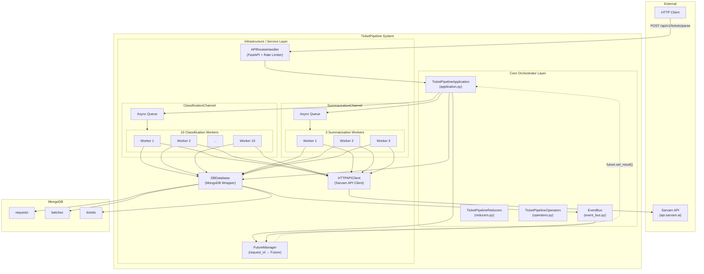
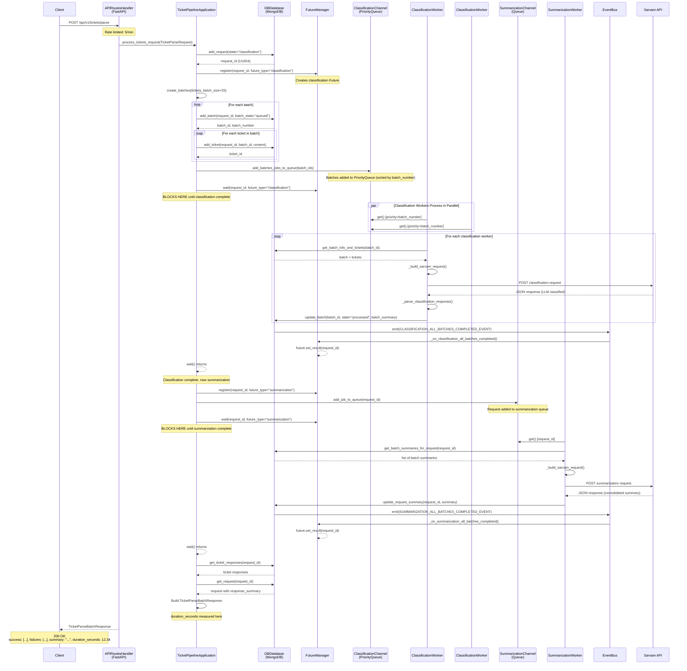
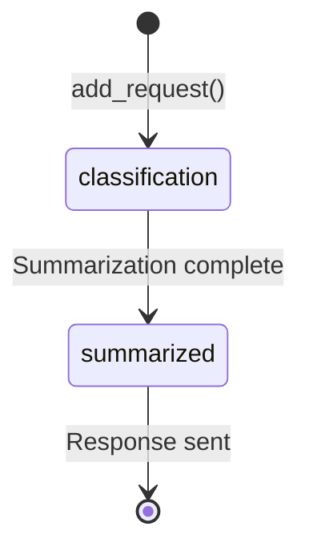
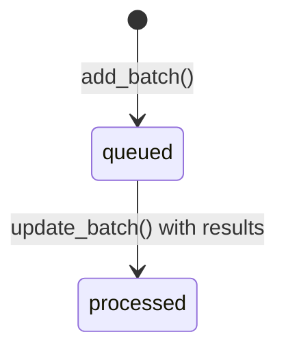
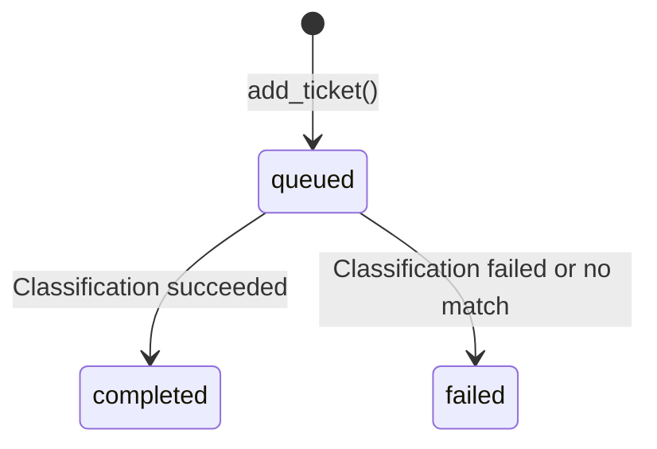

# Ticket Pipeline Architecture

This document describes the architecture of the Sarvam Ticket Pipeline system.

---

## Overview

The ticket pipeline is a two-stage async processing system that classifies support tickets and generates consolidated summaries using the Sarvam AI API.

**Key Characteristics:**
- Rate limited: 5 requests/minute per client
- Batches tickets into groups of **25** for efficient API calls
- **10 parallel classification workers**
- **5 parallel summarization workers**
- Two-stage pipeline: classification → summarization
- Async coordination via `asyncio.Future` and `EventBus`
- Runs as 4 services via Docker Compose: MongoDB, Prometheus, Grafana, Ticket Pipeline API

---

## Docker Compose Services

The system runs as a containerized stack with 4 services:

| Service | Image | Port | Description |
|---------|-------|------|-------------|
| `mongodb` | mongo:7 | 27017 | Document database for requests, batches, tickets, metrics |
| `prometheus` | prom/prometheus:latest | 9090 | Metrics collection and alerting |
| `grafana` | grafana/grafana:latest | 3000 | Metrics visualization dashboards |
| `ticket-pipeline` | (build) | 8000 | FastAPI application server |

See [docker-compose.yml](../docker-compose.yml) for full service configuration.

---

## Architecture Diagram



---

## Complete Sequence Diagram



---

## Processing Pipeline

```mermaid
flowchart LR
    subgraph Stage1["Stage 1: Classification"]
        direction TB
        Input["Tickets"] --> Batch["Create Batches<br/>(25 tickets/batch)"]
        Batch --> ClassQueue["Classification PriorityQueue"]
        ClassQueue --> Workers["CLASSIFICATION_WORKER_COUNT<br/>Workers (env var)"]
        Workers --> Sarvam["Sarvam API"]
        Sarvam --> Update["update_batch()"]
        Update --> Event1["CLASSIFICATION_ALL_BATCHES_COMPLETED"]
    end

    subgraph Stage2["Stage 2: Summarization"]
        direction TB
        Event1 --> SumQueue["Summarization Queue"]
        SumQueue --> SumWorkers["SUMMARIZATION_WORKER_COUNT<br/>Workers (env var)"]
        SumWorkers --> GetSummaries["get_batch_summaries()"]
        GetSummaries --> Sarvam2["Sarvam API"]
        Sarvam2 --> FinalSummary["update_request_summary()"]
        FinalSummary --> Event2["SUMMARIZATION_ALL_BATCHES_COMPLETED"]
    end

    Event2 --> Response["TicketParseBatchResponse<br/>(success + failures + summary + duration_seconds)"]
```



---

## State Machines

### Request States



### Batch States



### Ticket States



---

## Tunable Parameters

The following parameters can be adjusted to modify pipeline behavior and performance. **Worker counts are configured via environment variables** — see [.env](.env) and [experiment.md](experiment.md) for details.

| Parameter | Default | Env Variable | Description |
|-----------|---------|--------------|-------------|
| `BATCH_SIZE` | `25` | — | Max tickets per batch sent to Sarvam API |
| `CLASSIFICATION_WORKER_COUNT` | `10` | `CLASSIFICATION_WORKER_COUNT` | Number of parallel classification workers |
| `SUMMARIZATION_WORKER_COUNT` | `5` | `SUMMARIZATION_WORKER_COUNT` | Number of parallel summarization workers |
| `API_RATE_LIMIT` | `5/minute` | — | Rate limit on parse endpoint per client |
| `FUTURE_TIMEOUT` | `2000s` | — | Max wait time for classification/summarization futures |
| `SARVAM_RETRY_ATTEMPTS` | `3` | — | Retries on Sarvam API failure |
| `SARVAM_RETRY_INITIAL_DELAY` | `2s` | — | Initial backoff delay |
| `SARVAM_RETRY_MAX_DELAY` | `10s` | — | Max backoff delay |
| `MAX_TICKETS_PER_REQUEST` | `500` | — | Max tickets in a single parse request |
| `SARVAM_MODEL` | `sarvam-m` | — | Sarvam model used for classification/summarization |
| `SARVAM_MAX_TOKENS` | `2000` | — | Max tokens in Sarvam response |

### Impact of Parameters

| Parameter Change | Expected Impact |
|-----------------|----------------|
| Increase `CLASSIFICATION_WORKER_COUNT` | Higher parallelism for classification, better throughput |
| Increase `SUMMARIZATION_WORKER_COUNT` | Higher parallelism for summarization stage |
| Increase `BATCH_SIZE` | Fewer API calls, higher per-call latency, lower overhead |
| Decrease `BATCH_SIZE` | More API calls, lower per-call latency, higher overhead |
| Increase `FUTURE_TIMEOUT` | More tolerant of slow API responses, risk of hanging longer |
| Increase `SARVAM_RETRY_ATTEMPTS` | Better resilience to transient failures, longer max latency |

> **Experiment with worker counts:** See [experiment.md](experiment.md) for a guide to benchmarking different worker configurations.

---

## Component Details

### 1. APIRoutesHandler (`engine/operators/api_routes_handler.py`)
- FastAPI server with rate limiting (5/min per client)
- Endpoint: `POST /api/v1/tickets/parse`
- Returns `TicketParseBatchResponse` with `success`, `failures`, `summary`, `duration_seconds`

### 2. TicketPipelineApplication (`engine/application.py`)
- Orchestrates the two-stage pipeline
- Measures `duration_seconds` from request start to response
- Manages request/batch/ticket creation in MongoDB

### 3. ClassificationChannel (`engine/operators/classification_channel.py`)
- Workers count from `CLASSIFICATION_WORKER_COUNT` env var (default: 10)
- Parallel workers via `asyncio.PriorityQueue`
- Priority based on `batch_number` for FIFO ordering
- 3 retries with exponential backoff on Sarvam API failures

### 4. SummarizationChannel (`engine/operators/summarization_channel.py`)
- Workers count from `SUMMARIZATION_WORKER_COUNT` env var (default: 5)
- Parallel workers via `asyncio.Queue`
- Collects batch summaries and produces consolidated summary

### 5. FutureManager (`engine/operators/future_manager.py`)
- Maps `request_id` to `asyncio.Future`
- Resolved by EventBus events after each stage completes

### 6. EventBus (`engine/event_bus.py`)
- Pub/sub for `classification_all_batches_completed` and `summarization_all_batches_completed`

### 7. DBDatabase (`engine/operators/db/db.py`)
- MongoDB wrapper with schema validation
- Collections: `requests`, `batches`, `tickets`, `metrics`
- See [schema.md](schema.md) for full MongoDB schema documentation

---

## File Structure

```
engine/
├── main.py                          # Entry point
├── orchestrator.py                  # TicketPipeline - component wiring
├── application.py                   # TicketPipelineApplication - business logic
├── event_bus.py                     # EventBus - pub/sub
├── reducers.py                      # TicketPipelineReducers - state management
├── models/
│   ├── api_request_models.py        # HTTP request/response models
│   ├── classification_models.py     # Classification request/response
│   ├── db_models.py                 # Database models
│   └── http_client_models.py        # HTTP client models
└── operators/
    ├── operators.py                 # TicketPipelineOperators - composition
    ├── api_routes_handler.py        # FastAPI server + rate limiting
    ├── classification_channel.py    # Worker pool (count from CLASSIFICATION_WORKER_COUNT env)
    ├── summarization_channel.py     # Worker pool (count from SUMMARIZATION_WORKER_COUNT env)
    ├── future_manager.py            # Future coordination
    └── db/
        ├── db.py                    # DBDatabase - MongoDB wrapper
        └── schema.json              # Schema validation
```

---

## Benchmarking & Experimentation

- [benchmark.md](benchmark.md) — Performance benchmarks (depends on worker counts and payload size)
- [experiment.md](experiment.md) — Guide to benchmarking different worker configurations

---

## Error Handling

| Scenario | Behavior |
|----------|----------|
| Sarvam API timeout | Retry 3 times with exponential backoff |
| Invalid response format | Log error, mark ticket as failure |
| Classification timeout (>2000s) | Raise `asyncio.TimeoutError` |
| Summarization timeout (>2000s) | Raise `asyncio.TimeoutError` |
| Rate limit exceeded | Return 429 Too Many Requests |
| MongoDB connection failure | Raise connection exception |