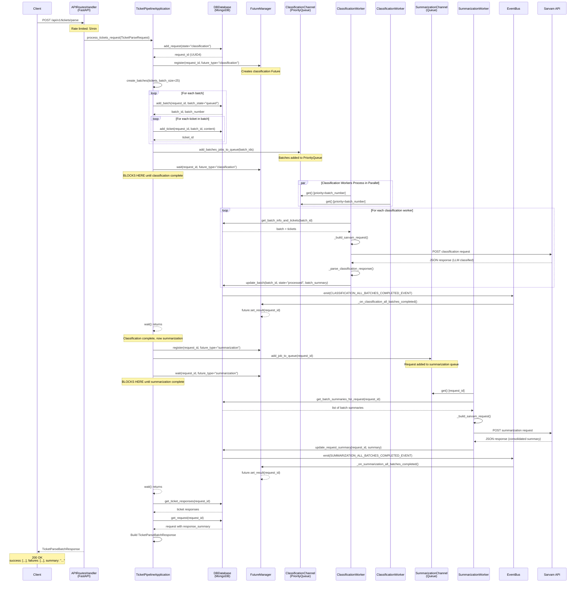
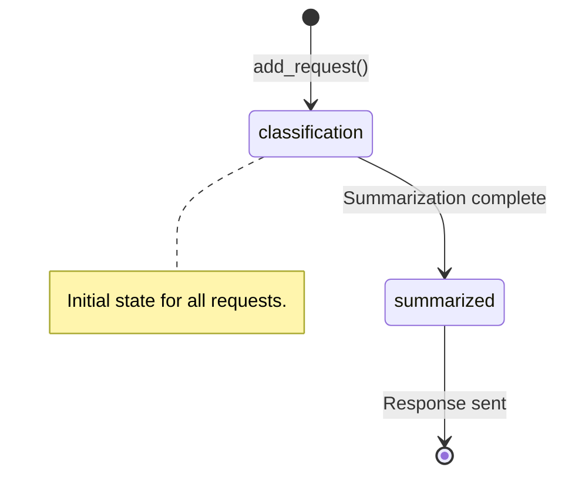
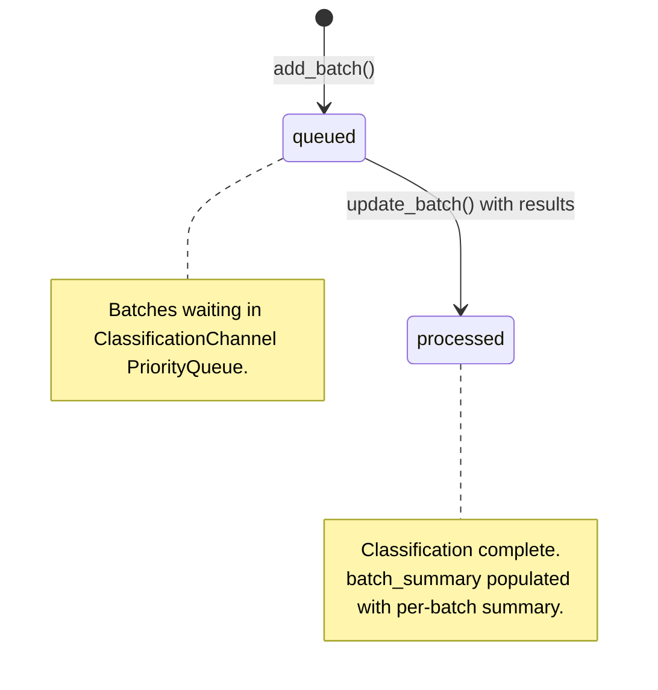
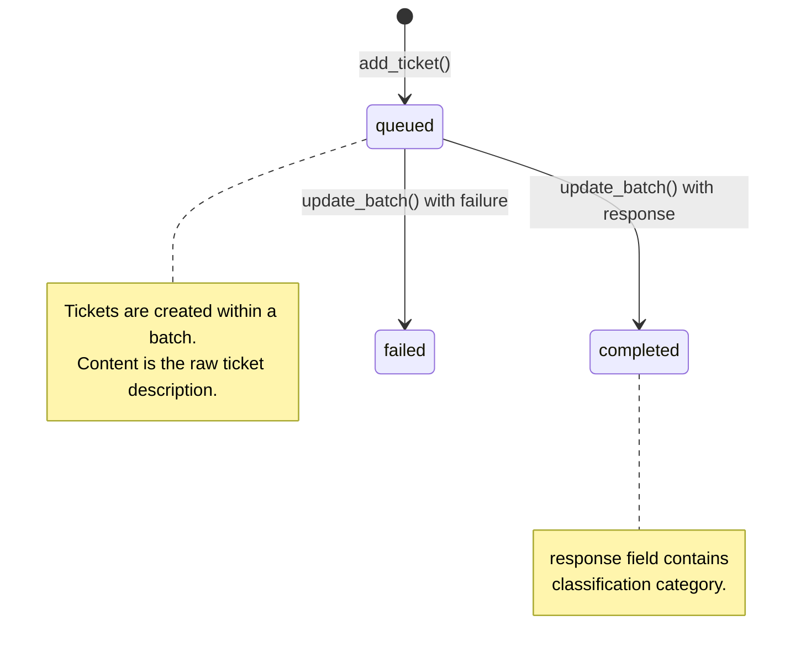

# Parse Request Flow Documentation

This document describes the complete flow of a ticket parse request through the Sarvam Ticket Pipeline system.

## Overview

The parse request flow handles incoming HTTP requests to classify support tickets into categories (hardware_issue, software_issue, model_quality, billing, other) and generate a consolidated summary. It uses a two-stage worker pool pattern with event-driven completion notification.

**Key Characteristics:**
- Rate limited: 5 requests/minute per client
- Batches tickets into groups of 25 for efficient API calls
- 10 parallel classification workers
- 3 parallel summarization workers
- Two-stage pipeline: classification → summarization
- Async coordination via asyncio.Future and EventBus

---

## Two-Stage Sequence Diagram



---

## Architecture Diagram

```mermaid
flowchart TB
    subgraph External
        Client["HTTP Client"]
        SarvamAPI["Sarvam API<br/>(api.sarvam.ai)"]
    end

    subgraph Orchestrator["TicketPipeline (orchestrator.py)"]
        direction TB
        EventBus["EventBus<br/>(event_bus.py)"]
        Reducers["TicketPipelineReducers<br/>(reducers.py)"]
        Operators["TicketPipelineOperators<br/>(operators.py)"]
        Application["TicketPipelineApplication<br/>(application.py)"]
    end

    subgraph Operators["TicketPipelineOperators"]
        APIRoutes["APIRoutesHandler<br/>(FastAPI + Rate Limiter)"]
        HTTPClient["HTTPAPIClient<br/>(Sarvam API Client)"]
        DB["DBDatabase<br/>(MongoDB Wrapper)"]
        ClassChannel["ClassificationChannel<br/>(10 Workers + Queue)"]
        SumChannel["SummarizationChannel<br/>(3 Workers + Queue)"]
        FutureMgr["FutureManager<br/>(request_id → Future)"]
    end

    subgraph ClassWorkers["ClassificationChannel"]
        direction LR
        CW1["Worker 1"]
        CW2["Worker 2"]
        CW10["Worker 10"]
    end

    subgraph SumWorkers["SummarizationChannel"]
        direction LR
        SW1["Worker 1"]
        SW2["Worker 2"]
        SW3["Worker 3"]
    end

    subgraph Database["MongoDB"]
        ReqColl["requests collection"]
        BatchColl["batches collection"]
        TicketColl["tickets collection"]
    end

    Client -->|"POST /api/v1/tickets/parse"| APIRoutes
    APIRoutes --> Application
    Application --> DB
    Application --> FutureMgr
    Application --> ClassChannel
    Application --> SumChannel
    ClassChannel --> ClassWorkers
    ClassWorkers --> HTTPClient
    HTTPClient --> SarvamAPI
    SumChannel --> SumWorkers
    SumWorkers --> HTTPClient
    DB --> ReqColl
    DB --> BatchColl
    DB --> TicketColl
    ClassWorkers --> DB
    SumWorkers --> DB
    EventBus --> FutureMgr
    DB --> EventBus
    FutureMgr -.->|future.set_result()| Application
```

---

## Processing Pipeline

```mermaid
flowchart LR
    subgraph Stage1["Stage 1: Classification"]
        direction TB
        Input["Tickets"] --> Batch["Create Batches<br/>(25 tickets/batch)"]
        Batch --> ClassQueue["Classification Queue"]
        ClassQueue --> Workers["10 Workers"]
        Workers --> Sarvam["Sarvam API"]
        Sarvam --> Update["update_batch()"]
        Update --> Event1["CLASSIFICATION_ALL_BATCHES_COMPLETED"]
    end

    subgraph Stage2["Stage 2: Summarization"]
        direction TB
        Event1 --> SumQueue["Summarization Queue"]
        SumQueue --> SumWorkers["3 Workers"]
        SumWorkers --> GetSummaries["get_batch_summaries()"]
        GetSummaries --> Sarvam2["Sarvam API"]
        Sarvam2 --> FinalSummary["update_request_summary()"]
        FinalSummary --> Event2["SUMMARIZATION_ALL_BATCHES_COMPLETED"]
    end

    Event2 --> Response["TicketParseBatchResponse<br/>(success + failures + summary)"]
```



---

## State Machine

### Request States



### Batch States



### Ticket States



### Classification Categories

| Category | Description |
|----------|-------------|
| `hardware_issue` | Physical equipment problems |
| `software_issue` | Application/software bugs |
| `model_quality` | AI model output issues |
| `billing` | Payment/invoice problems |
| `other` | Doesn't fit other categories |

---

## Component Details

### 1. APIRoutesHandler (`engine/operators/api_routes_handler.py`)

**Purpose:** FastAPI server with rate limiting

**Endpoint:** `POST /api/v1/tickets/parse`

```python
@app.post("/api/v1/tickets/parse", response_model=TicketParseBatchResponse)
@self._limiter.limit("5/minute")
async def parse_tickets(request: Request, body: TicketParseRequest):
    response = await self.application.process_tickets_request(body)
    return response
```

**Rate Limit:** 5 requests per minute per client

---

### 2. TicketPipelineApplication (`engine/application.py`)

**Purpose:** Business logic orchestration

**Key Method:** `process_tickets_request()`

```python
async def process_tickets_request(self, request: TicketParseRequest) -> TicketParseBatchResponse:
    # 1. Create request record
    request_output = await self.db.add_request(state="classification", request_id=None)
    request_id = request_output.request_id

    # 2. Register future for classification
    self.operators.future_manager.register(request_id, future_type="classification")

    # 3. Create batches and add to DB
    batches = await self.create_batches(request.tickets)
    for batch in batches:
        batch_output = await self.db.add_batch(...)
        for ticket_content in batch:
            await self.db.add_ticket(...)

    # 4. Enqueue batches for classification
    await self.operators.classification_channel.add_batches_jobs_to_queue(batch_ids)

    # 5. Wait for classification to complete
    await self.operators.future_manager.wait(request_id, future_type="classification")

    # 6. Register future for summarization
    self.operators.future_manager.register(request_id, future_type="summarization")

    # 7. Enqueue request for summarization
    await self.operators.summarization_channel.add_job_to_queue(request_id)

    # 8. Wait for summarization to complete
    await self.operators.future_manager.wait(request_id, future_type="summarization")

    # 9. Get results and return
    tickets_output = await self.db.get_ticket_responses(request_id)
    request_record = await self.db.get_request(request_id)
    summary = request_record.get("response_summary")

    return TicketParseBatchResponse(
        success=...,
        failures=...,
        summary=summary,
    )
```

---

### 3. ClassificationChannel (`engine/operators/classification_channel.py`)

**Purpose:** Worker pool for async classification processing

**Initialization:**
```python
async def initialize(self):
    self._classification_queue: asyncio.PriorityQueue = asyncio.PriorityQueue()
    self._worker_tasks = [
        asyncio.create_task(self.classification_worker(), name=f"classification_worker_{i}")
        for i in range(self._worker_count)  # 10 workers
    ]
```

**Worker Loop:**
```python
async def classification_worker(self):
    while True:
        _, batch_id = await self._classification_queue.get()

        # Fetch batch and tickets from DB
        batch_info_and_tickets = await self._db_ref.get_batch_info_and_tickets(batch_id)

        # Call Sarvam API with retry (3 attempts, exponential backoff)
        classification_response = await self.invoke_sarvam_for_classification(classification_input)

        # Parse response (strips thinking blocks)
        parsed = self._parse_classification_response(classification_response)

        # Update batch with summary and ticket responses
        await self._db_ref.update_batch(UpdateBatchInput(
            batch_id=batch_id,
            batch_state="processed",
            batch_summary=parsed.summary,
            ticket_updates=[TicketUpdateItem(...) for item in parsed.ticket_classifications],
        ))
```

---

### 4. SummarizationChannel (`engine/operators/summarization_channel.py`)

**Purpose:** Worker pool for creating consolidated summaries from batch summaries

**Initialization:**
```python
async def initialize(self):
    self._summarization_queue = asyncio.Queue()
    self._worker_tasks = [
        asyncio.create_task(self.summarization_worker(), name=f"summarization_worker_{i}")
        for i in range(self._worker_count)  # 3 workers
    ]
```

**Worker Loop:**
```python
async def summarization_worker(self):
    while True:
        request_id = await self._summarization_queue.get()

        # Get all batch summaries for this request
        batch_summaries = await self._db_ref.get_batch_summaries_for_request(request_id)

        # Build summarization request with batch summaries
        summarization_input = [
            {"batch_number": i + 1, "summary": summary}
            for i, summary in enumerate(batch_summaries)
        ]

        # Call Sarvam API with retry
        raw_response = await self.invoke_sarvam_for_summarization(summarization_input)
        final_summary = self._parse_summarization_response(raw_response)

        # Update request record with final summary
        await self._db_ref.update_request_summary(request_id, final_summary)

        # Emit event
        await self._event_bus.emit(
            SUMMARIZATION_ALL_BATCHES_COMPLETED_EVENT,
            data=SummarizationAllBatchesCompletedPayload(
                request_id=request_id,
                summary=final_summary,
            ).model_dump(),
        )
```

---

### 5. FutureManager (`engine/operators/future_manager.py`)

**Purpose:** Maps request_id to asyncio.Future for async coordination

**Key Methods:**

```python
class FutureManager:
    def register(self, request_id: str, future_type: str = "classification") -> asyncio.Future[str]:
        """Create a new future for this request and future_type."""
        if future_type == "classification":
            self._classification_futures[request_id] = loop.create_future()
        else:
            self._summarization_futures[request_id] = loop.create_future()

    async def wait(self, request_id: str, timeout: float = 2000, future_type: str = "classification") -> str:
        """Block until future is resolved for the specified future_type."""
        if future_type == "classification":
            return await asyncio.wait_for(self._classification_futures[request_id], timeout=timeout)
        return await asyncio.wait_for(self._summarization_futures[request_id], timeout=timeout)
```

**Events Subscribed:**
- `classification_all_batches_completed` → resolves classification future
- `summarization_all_batches_completed` → resolves summarization future

---

### 6. EventBus (`engine/event_bus.py`)

**Purpose:** Pub/sub for domain events

**Events:**

| Event | Payload | Description |
|-------|---------|-------------|
| `classification_all_batches_completed` | `ClassificationAllBatchesCompletedPayload` | All batches for a request finished classification |
| `summarization_all_batches_completed` | `SummarizationAllBatchesCompletedPayload` | Summarization completed, contains final summary |

---

### 7. DBDatabase (`engine/operators/db/db.py`)

**Purpose:** MongoDB wrapper with schema validation

**New Methods:**

```python
async def get_batch_summaries_for_request(self, request_id: str) -> list[str]:
    """Get all batch_summary values for batches in a request."""
    batches = list(self.batches_collection.find({"request_id": request_id}))
    return [b.get("batch_summary", "") for b in batches if b.get("batch_summary")]

async def update_request_summary(self, request_id: str, summary: str) -> None:
    """Update request's response_summary and state to 'summarized'."""
    self.requests_collection.update_one(
        {"request_id": request_id},
        {"$set": {"response_summary": summary, "state": "summarized", "updatedAt": self._now()}}
    )

async def get_request(self, request_id: str) -> Optional[Dict[str, Any]]:
    """Get a request record by request_id."""
    return self.requests_collection.find_one({"request_id": request_id})
```

---

## API Reference

### POST /api/v1/tickets/parse

**Request:**
```json
{
  "tickets": [
    {"description": "My screen is flickering when I connect to the projector"},
    {"description": "The billing amount seems incorrect for last month"}
  ]
}
```

**Response (200 OK):**
```json
{
  "success": [
    {
      "description": "My screen is flickering when I connect to the projector",
      "classification": "hardware_issue"
    }
  ],
  "failures": [],
  "summary": "Hardware issues dominate the ticket volume with display connectivity problems being most common. Billing concerns form a secondary category requiring attention.",
  "total": 1,
  "success_count": 1,
  "failure_count": 0
}
```

---

## Error Handling

| Scenario | Behavior |
|----------|----------|
| Sarvam API timeout | Retry 3 times with exponential backoff |
| Invalid response format | Log error, mark ticket as failure |
| Classification timeout (>2000s) | Raise asyncio.TimeoutError |
| Summarization timeout (>2000s) | Raise asyncio.TimeoutError |
| Rate limit exceeded | Return 429 Too Many Requests |
| MongoDB connection failure | Raise connection exception |

---

## File Structure

```
engine/
├── main.py                          # Entry point
├── orchestrator.py                  # TicketPipeline - component wiring
├── application.py                   # TicketPipelineApplication - business logic
├── event_bus.py                     # EventBus - pub/sub (classification + summarization events)
├── reducers.py                      # TicketPipelineReducers - state management
├── models/
│   ├── api_request_models.py        # HTTP request/response models (now includes summary)
│   ├── classification_models.py     # Classification request/response
│   ├── db_models.py                 # Database models
│   └── http_client_models.py        # HTTP client models
└── operators/
    ├── operators.py                 # TicketPipelineOperators - composition (now includes summarization)
    ├── api_routes_handler.py        # FastAPI server + rate limiting
    ├── classification_channel.py     # Worker pool (10 workers)
    ├── summarization_channel.py     # NEW: Worker pool (3 workers)
    ├── future_manager.py            # Future coordination (now handles both types)
    └── db/
        ├── db.py                    # DBDatabase - MongoDB wrapper (now has get_batch_summaries_for_request, update_request_summary, get_request)
        └── schema.json              # Schema validation
```

---

## Configuration

| Parameter | Default | Description |
|-----------|---------|-------------|
| `SARVAM_API_KEY` | - | Required. API key for Sarvam AI |
| `SARVAM_BASE_URL` | `https://api.sarvam.ai/v1` | Sarvam API base URL |
| `MONGO_HOST` | `localhost` | MongoDB host |
| `MONGO_PORT` | `27017` | MongoDB port |
| `CLASSIFICATION_WORKER_COUNT` | `10` | Number of classification workers |
| `SUMMARIZATION_WORKER_COUNT` | `3` | Number of summarization workers |
| `BATCH_SIZE` | `25` | Max tickets per batch |
| `RATE_LIMIT` | `5/minute` | API rate limit |
| `FUTURE_TIMEOUT` | `2000s` | Max wait time for any stage |