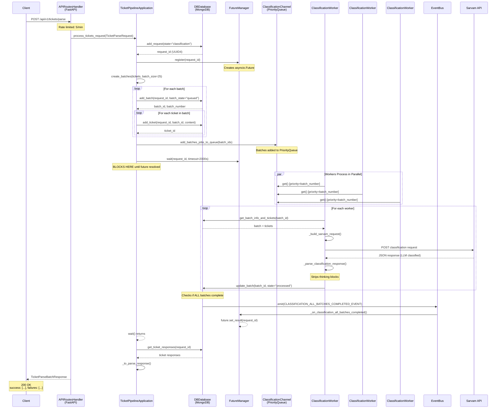
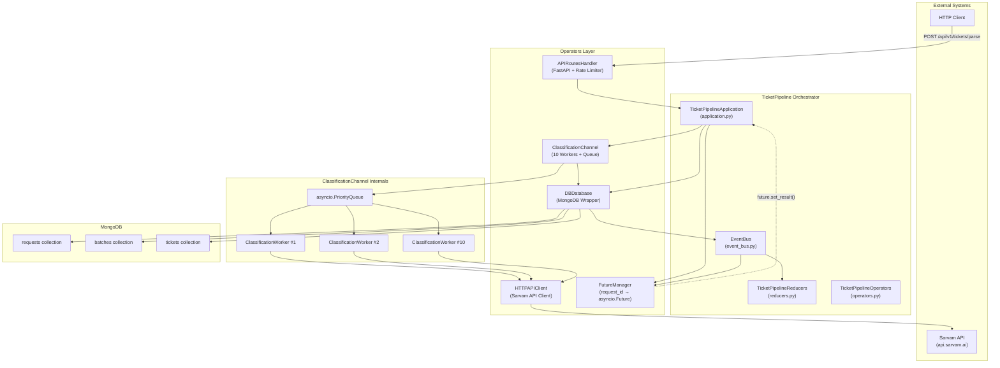
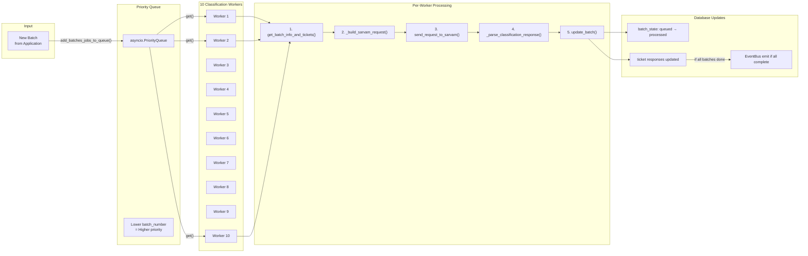
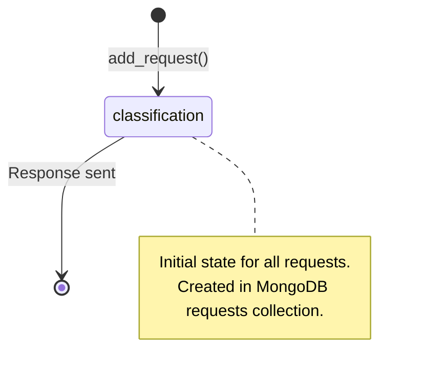
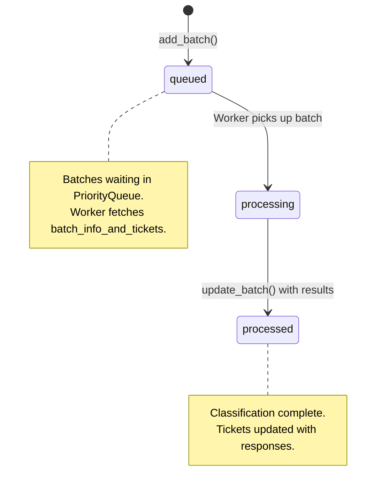
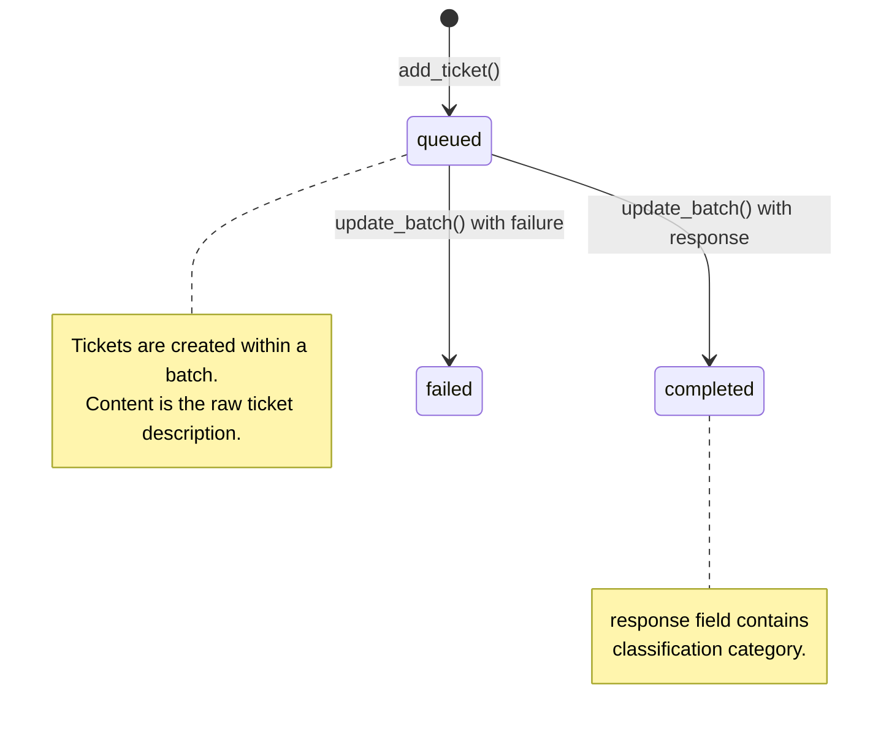

# Parse Request Flow Documentation

This document describes the complete flow of a ticket parse request through the Sarvam Ticket Pipeline system.

## Overview

The parse request flow handles incoming HTTP requests to classify support tickets into categories (hardware_issue, software_issue, model_quality, billing, other). It uses a worker pool pattern with event-driven completion notification.

**Key Characteristics:**
- Rate limited: 5 requests/minute per client
- Batches tickets into groups of 25 for efficient API calls
- 10 parallel workers process classification requests
- Async coordination via asyncio.Future and EventBus

---

## Sequence Diagram



---

## Architecture Diagram



---

## Classification Worker Pool Diagram



---

## State Machine

### Request States



### Batch States



### Ticket States



### Classification Categories

The system classifies tickets into these categories:

| Category | Description |
|----------|-------------|
| `hardware_issue` | Physical equipment problems |
| `software_issue` | Application/software bugs |
| `model_quality` | AI model output issues |
| `billing` | Payment/invoice problems |
| `other` | Doesn't fit other categories |

---

## Component Details

### 1. APIRoutesHandler (`engine/operators/api_routes_handler.py`)

**Purpose:** FastAPI server with rate limiting

**Endpoint:** `POST /api/v1/tickets/parse`

```python
@app.post("/api/v1/tickets/parse", response_model=TicketParseBatchResponse)
@self._limiter.limit("5/minute")
async def parse_tickets(request: Request, body: TicketParseRequest):
    response = await self.application.process_tickets_request(body)
    return response
```

**Rate Limit:** 5 requests per minute per client

**Request Model:** `TicketParseRequest`
```python
class TicketParseRequest(BaseModel):
    tickets: list[TicketInput]  # Max 25 per batch, batches auto-created
```

**Response Model:** `TicketParseBatchResponse`
```python
class TicketParseBatchResponse(BaseModel):
    success: list[TicketParseSuccessItem]  # Classified tickets
    failures: list[str]  # Failed ticket descriptions
```

---

### 2. TicketPipelineApplication (`engine/application.py`)

**Purpose:** Business logic orchestration

**Key Method:** `process_tickets_request()`

```python
async def process_tickets_request(self, request: TicketParseRequest) -> TicketParseBatchResponse:
    # 1. Create request record
    request_output = await self.db.add_request(state="classification", request_id=None)
    request_id = request_output.request_id

    # 2. Register future for this request
    self.operators.future_manager.register(request_id)

    # 3. Create batches (max 25 tickets each)
    batches = await self.create_batches(request.tickets)

    # 4. For each batch: create DB records
    for batch in batches:
        batch_output = await self.db.add_batch(request_id=request_id, ...)
        for ticket in batch:
            await self.db.add_ticket(...)

    # 5. Enqueue batches for classification
    await self.operators.classification_channel.add_batches_jobs_to_queue(batch_ids)

    # 6. Wait for classification to complete
    await self.operators.future_manager.wait(request_id)

    # 7. Get results and return
    tickets_output = await self.db.get_ticket_responses(request_id)
    return self._to_parse_response(tickets_output)
```

---

### 3. ClassificationChannel (`engine/operators/classification_channel.py`)

**Purpose:** Worker pool for async classification processing

**Initialization:**
```python
async def initialize(self):
    self._classification_queue: asyncio.PriorityQueue = asyncio.PriorityQueue()
    self._worker_tasks = [asyncio.create_task(self.classification_worker()) for i in range(10)]
```

**Worker Loop:**
```python
async def classification_worker(self):
    while True:
        _, batch_id = await self._classification_queue.get()

        # Fetch batch and tickets from DB
        batch_info_and_tickets = await self._db_ref.get_batch_info_and_tickets(batch_id)

        # Build request to Sarvam
        classification_input = ClassificationRequestMessageInputModel(
            tickets=[TickerInformation(ticket_id=t.ticket_id, description=t.content) for t in tickets]
        )

        # Call Sarvam API with retry (3 attempts, exponential backoff)
        classification_response = await self.invoke_sarvam_for_classification(classification_input)

        # Parse response (strips thinking blocks)
        parsed = self._parse_classification_response(classification_response)

        # Update batch and tickets in DB
        await self._db_ref.update_batch(UpdateBatchInput(
            batch_id=batch_id,
            batch_state="processed",
            batch_summary=parsed.summary,
            ticket_updates=[TicketUpdateItem(ticket_id=item.ticket_id, state="completed", response=item.category) ...]
        ))
```

**Sarvam Request Format:**
```python
SarvamAPIRequest(
    model="sarvam-m",
    max_tokens=2000,
    messages=[
        SarvamMessages(role="system", content=classification_job_system_message),
        SarvamMessages(role="user", content=json.dumps([t.model_dump() for t in classification_input.tickets]))
    ]
)
```

**System Prompt:** Instructs LLM to classify into: hardware_issue, software_issue, model_quality, billing, other

---

### 4. FutureManager (`engine/operators/future_manager.py`)

**Purpose:** Maps request_id to asyncio.Future for async coordination

**Key Methods:**

```python
class FutureManager:
    def register(self, request_id: str) -> asyncio.Future[str]:
        """Create a new future for this request"""
        future = loop.create_future()
        self._futures[request_id] = future
        return future

    async def wait(self, request_id: str, timeout: float = 2000) -> str:
        """Block until future is resolved"""
        return await asyncio.wait_for(self._futures[request_id], timeout=timeout)

    async def _on_classification_all_batches_completed(self, data: Any) -> None:
        """EventBus callback - resolves the future"""
        payload = ClassificationAllBatchesCompletedPayload.model_validate(data)
        future = self._futures.get(payload.request_id)
        future.set_result(payload.request_id)
```

**Event Subscription:**
```python
async def initialize(self):
    await self._event_bus.subscribe(
        CLASSIFICATION_ALL_BATCHES_COMPLETED_EVENT,
        self._on_classification_all_batches_completed,
    )
```

---

### 5. EventBus (`engine/event_bus.py`)

**Purpose:** Pub/sub for domain events

**Key Event:** `CLASSIFICATION_ALL_BATCHES_COMPLETED_EVENT`

**Emission Point** (`engine/operators/db/db.py`):
```python
async def update_batch(self, input: UpdateBatchInput) -> None:
    # ... update logic ...

    # Check if all batches complete
    batches_completed = await self.get_all_batches_completed(request_id)
    if batches_completed.completed and self._event_bus is not None:
        await self._event_bus.emit(
            CLASSIFICATION_ALL_BATCHES_COMPLETED_EVENT,
            data=ClassificationAllBatchesCompletedPayload(
                request_id=request_id,
                batch_count=batch_count,
            ).model_dump(),
        )
```

**Payload:**
```python
class ClassificationAllBatchesCompletedPayload(BaseModel):
    request_id: str
    batch_count: int
```

---

### 6. DBDatabase (`engine/operators/db/db.py`)

**Purpose:** MongoDB wrapper with schema validation

**Collections:**
- `requests` - Parse requests
- `batches` - Batches of tickets
- `tickets` - Individual ticket records

**Key Methods:**

| Method | Description |
|--------|-------------|
| `add_request()` | Create request record |
| `add_batch()` | Create batch record |
| `add_ticket()` | Create ticket record |
| `get_batch_info_and_tickets()` | Fetch batch + tickets for processing |
| `update_batch()` | Update batch state and ticket responses |
| `get_all_batches_completed()` | Check if all batches for request are processed |
| `get_ticket_responses()` | Get all tickets with their responses |

**Schema Validation:** Auto-applied from `schema.json` on initialization

---

## API Reference

### POST /api/v1/tickets/parse

**Request:**
```json
{
  "tickets": [
    {
      "description": "My screen is flickering when I connect to the projector"
    },
    {
      "description": "The billing amount seems incorrect for last month"
    }
  ]
}
```

**Response (200 OK):**
```json
{
  "success": [
    {
      "description": "My screen is flickering when I connect to the projector",
      "classification": "hardware_issue"
    }
  ],
  "failures": []
}
```

**Response with Failures (200 OK):**
```json
{
  "success": [],
  "failures": [
    "The billing amount seems incorrect for last month"
  ]
}
```

---

## Error Handling

| Scenario | Behavior |
|----------|----------|
| Sarvam API timeout | Retry 3 times with exponential backoff |
| Invalid response format | Log error, mark ticket as failure |
| All batches timeout (>2000s) | Raise asyncio.TimeoutError |
| Rate limit exceeded | Return 429 Too Many Requests |
| MongoDB connection failure | Raise connection exception |

---

## File Structure

```
engine/
├── main.py                          # Entry point
├── orchestrator.py                  # TicketPipeline - component wiring
├── application.py                   # TicketPipelineApplication - business logic
├── event_bus.py                     # EventBus - pub/sub
├── reducers.py                      # TicketPipelineReducers - state management
├── models/
│   ├── api_request_models.py        # HTTP request/response models
│   ├── classification_models.py     # Classification request/response
│   ├── db_models.py                 # Database models
│   └── http_client_models.py        # HTTP client models
└── operators/
    ├── operators.py                 # TicketPipelineOperators - composition
    ├── api_routes_handler.py        # FastAPI server + rate limiting
    ├── classification_channel.py    # Worker pool
    ├── future_manager.py            # Future coordination
    └── db/
        ├── db.py                    # DBDatabase - MongoDB wrapper
        └── schema.json              # Schema validation
```

---

## Configuration

| Parameter | Default | Description |
|-----------|---------|-------------|
| `SARVAM_API_KEY` | - | Required. API key for Sarvam AI |
| `SARVAM_BASE_URL` | `https://api.sarvam.ai/v1` | Sarvam API base URL |
| `MONGO_HOST` | `localhost` | MongoDB host |
| `MONGO_PORT` | `27017` | MongoDB port |
| `WORKER_COUNT` | `10` | Number of classification workers |
| `BATCH_SIZE` | `25` | Max tickets per batch |
| `RATE_LIMIT` | `5/minute` | API rate limit |
| `FUTURE_TIMEOUT` | `2000s` | Max wait time for classification |